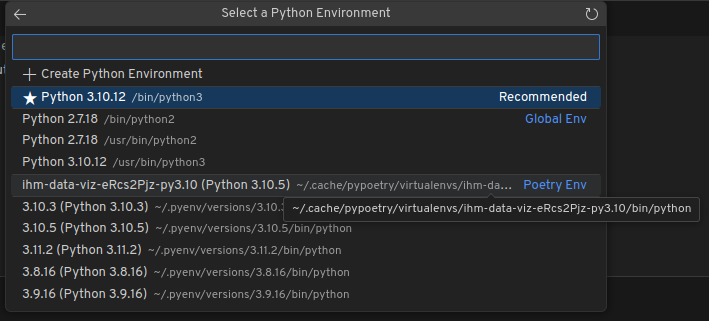

# TME IHM pour visualisation de données

Le notebook de ce sujet propose d'utiliser Poetry pour configurer un environnement virtuel ayant les mêmes versions
que celui de référence. C'est utile pour ne pas casser d'autres projets que vous pourriez avoir qui utiliseraient eux
des versions différentes.

Pour installer Poetry :
* sur tout système (Linux, Windows, Mac) : `curl -sSL https://install.python-poetry.org | python3 -`
* sous Windows avec PowerShell : `(Invoke-WebRequest -Uri https://install.python-poetry.org -UseBasicParsing).Content | python -`
* sous Mac (si brew utilisé) : `brew install poetry`

NE PAS utiliser `pip install poetry` qui associe poetry à une version particulière de Python

Ensuite, pour utiliser un environnement virtuel
* Lancer `poetry install`
* au lancement du notebook dans VSCode, s'assurer de sélectionner le bon noyau dans le menu en haut à droite

